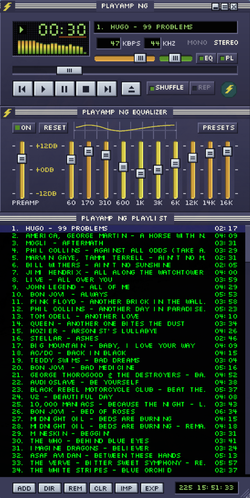

# PlayAmpNG

Reprodutor de áudio para desktop com a diagramação e as proporções do formato de skin do **Winamp 2.x**: painéis de tamanho fixo, fonte bitmap, analisador de espectro e equalizador de dez bandas.

Toca MP3, WAV, FLAC, Ogg Vorbis, Opus e AAC — local ou por streaming HTTP — com reprodução sem lacuna, ReplayGain e integração MPRIS.

**Licença: GPL-3.0-or-later** (`LICENSE`). A razão da escolha está em [`docs/DEPENDENCIES.md`](docs/DEPENDENCIES.md).

<p align="center">
  
</p>

As três janelas em escala 2×: player, equalizador de dez bandas e playlist. A arte é própria, desenhada no formato de skin do Winamp 2.x — o layout segue a geometria do formato, os pixels não são dele.

A linha curta em âmbar abaixo do tempo é o medidor de redução do limitador: ela acende quando o ganho do equalizador excede o que cabe na saída, e é a diferença entre ouvir o som "estranho" e ver por quê.

---

## Baixar e rodar

Os pacotes estão em **[Releases](https://github.com/lucasjr76/PlayAmpNG/releases)**. Todos são construídos e testados pelo CI a partir do mesmo commit, e acompanham um `SHA256SUMS.txt`.

| Sistema | Arquivo | Como usar |
|---|---|---|
| Linux | `PlayAmpNG-x86_64.AppImage` | `chmod +x` e executar. Não instala nada, não precisa de root. Exige glibc 2.39 ou mais novo (Ubuntu 24.04+) |
| Linux | `PlayAmpNG.flatpak` | `flatpak install --user PlayAmpNG.flatpak`. Sem o piso de glibc do AppImage |
| Windows | `PlayAmpNG-<versão>-setup.exe` | Instala no perfil do usuário, sem pedir administrador |
| macOS (Apple Silicon) | `PlayAmpNG-<versão>-macos-arm64.dmg` | Arrastar para Aplicativos. **Sem assinatura da Apple:** na primeira abertura, clique com o botão direito no app e escolha *Abrir* |

O pacote do macOS é montado e aberto pelo CI, mas **ainda não foi testado por uma pessoa num Mac** — relatos são bem-vindos. Macs com processador Intel não são atendidos por ele.

## Compilar a partir da fonte

### Dependências

| Item | Versão mínima | Pacote (Arch) | Pacote (Debian/Ubuntu) |
|---|---|---|---|
| CMake | 3.24 | `cmake` | `cmake` |
| Compilador C++20 | GCC 12 / Clang 15 | `gcc` | `g++` |
| Qt 6 (Widgets, Network, DBus) | 6.4 | `qt6-base` | `qt6-base-dev` |
| Qt 6 Wayland (só para gerar o AppImage) | 6.4 | `qt6-wayland` | `qt6-wayland` |
| FFmpeg (libavformat, libavcodec, libavutil, libswresample) | 6.0 | `ffmpeg` | `libavformat-dev libavcodec-dev libavutil-dev libswresample-dev` |
| zlib | 1.2 | `zlib` | `zlib1g-dev` |
| Python 3 | 3.9 | `python` | `python3` |

`miniaudio` é buscado pelo CMake com `FetchContent` numa tag fixa; a primeira compilação precisa de rede.

### Compilar, testar, instalar

```sh
cmake -S . -B build -DCMAKE_BUILD_TYPE=RelWithDebInfo
cmake --build build -j"$(nproc)"
ctest --test-dir build --output-on-failure
sudo cmake --install build --prefix /usr/local
```

A suíte roda sem tela e sem placa de som. Os testes que precisam de barramento D-Bus, servidor PulseAudio/PipeWire ou `pactl` são **pulados**, não reprovados, onde esses recursos não existirem.

### Gerar os pacotes

```sh
packaging/linux/build-appimage.sh          # -> dist/PlayAmpNG-x86_64.AppImage

flatpak install -y flathub org.kde.Platform//6.9 org.kde.Sdk//6.9
flatpak-builder --user --install --force-clean build-flatpak \
    packaging/linux/br.com.playampng.PlayAmpNG.yml
flatpak run br.com.playampng.PlayAmpNG
```

O script do AppImage baixa `linuxdeploy` e `appimagetool` na primeira execução e não exige root.

No Windows, com Qt e o ambiente do MSVC no `PATH`:

```powershell
packaging\windows\build-installer.ps1 -FfmpegRoot C:\ffmpeg
```

No Windows o log vai para `playampng.log`, ao lado da configuração em `%LOCALAPPDATA%\PlayAmpNG`; a execução anterior fica como `playampng.log.1`. Para vê-lo ao vivo no terminal, `playampng.exe --console` — nesse modo o player fica preso ao terminal e fechá-lo encerra o player.

Monta `dist\windows\`, um diretório que já roda por si só, e — se `makensis` estiver disponível — o instalador `PlayAmpNG-<versão>-setup.exe`. O instalador não pede administrador: instala em `%LOCALAPPDATA%`, as associações de arquivo são opcionais e desmarcadas, e desinstalar não apaga a configuração do usuário. O zlib do Windows vem do vcpkg (`vcpkg install zlib:x64-windows`, depois `ZLIB_ROOT`); o Qt para Windows não traz cabeçalho de zlib.

### Regerar a arte do skin

```sh
python3 tools/make_wsz.py          # bitmaps do formato + .wsz
cmake --build build --target pang_fontgen && ./build/pang_fontgen
```

A arte vive em código: qualquer ajuste é um diff legível. A tabela de glifos é **extraída da fonte Silkscreen** por `pang_fontgen`, e não desenhada à mão — três versões manuais saíram com forma de letra errada.

---

## Usar

| | |
|---|---|
| Atalhos de teclado | [`docs/ATALHOS.md`](docs/ATALHOS.md), e no programa: botão direito → *Atalhos de teclado* |
| Escolher a saída de áudio | botão direito na janela principal → *Dispositivo de saída* |
| Propriedades da faixa | botão direito → *Propriedades da faixa* |
| Trocar o skin | qualquer `.wsz` do Winamp 2.x, ou uma pasta com os bitmaps |

Teclas de mídia e controle pelo ambiente funcionam via MPRIS, sem a janela em foco.

---

## Documentação

| Arquivo | Conteúdo |
|---|---|
| [`docs/ARCHITECTURE.md`](docs/ARCHITECTURE.md) | camadas, contratos de thread, árvore do código |
| [`docs/REQUIREMENTS.md`](docs/REQUIREMENTS.md) | matriz de requisitos, com estado e evidência |
| [`docs/TEST_REPORT.md`](docs/TEST_REPORT.md) | o que foi medido, com números e máquina |
| [`docs/DEFEITOS.md`](docs/DEFEITOS.md) | defeitos encontrados em uso, causa medida e correção |
| [`docs/LIMITACOES.md`](docs/LIMITACOES.md) | o que o player **não** faz, e por quê |
| [`docs/APROXIMACOES.md`](docs/APROXIMACOES.md) | onde a aparência diverge da referência, e a medição |
| [`docs/DEPENDENCIES.md`](docs/DEPENDENCIES.md) | versões, licenças e a decisão de GPL-3.0 |
| [`docs/PLAN.md`](docs/PLAN.md) | marcos, riscos e o que ficou fora |
