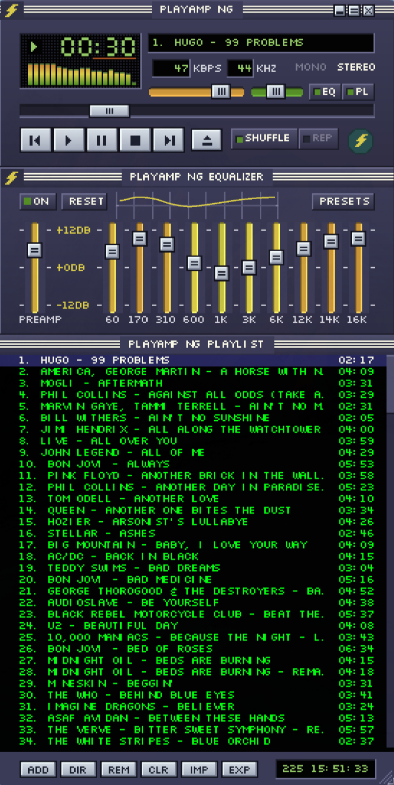

# PlayAmpNG

*Leia em [português](README.pt-BR.md).*

A desktop audio player with the layout and proportions of the **Winamp 2.x** skin format: fixed-size panels, a bitmap font, a spectrum analyser and a ten-band equaliser.

Plays MP3, WAV, FLAC, Ogg Vorbis, Opus and AAC — local files or HTTP streams — with gapless playback, ReplayGain and MPRIS integration.

**Licence: GPL-3.0-or-later** (`LICENSE`). The reasoning behind the choice is in [`docs/DEPENDENCIES.md`](docs/DEPENDENCIES.md).

> **A note on language.** The code comments, commit messages and everything under `docs/` are written in **Portuguese**. This README is the only translated document. Issues and pull requests in English are welcome.

<p align="center">
  
</p>

The three windows at 2× scale: player, ten-band equaliser and playlist. The artwork is our own, drawn in the Winamp 2.x skin format — the layout follows the geometry of the format, the pixels do not come from it.

The short amber line below the time display is the limiter's gain-reduction meter: it lights up when the equaliser gain exceeds what fits in the output, and it is the difference between hearing the sound go "strange" and seeing why.

---

## Download and run

The packages are on **[Releases](https://github.com/lucasjr76/PlayAmpNG/releases)**. All of them are built and tested by CI from the same commit, and ship with a `SHA256SUMS.txt`.

| System | File | How to use |
|---|---|---|
| Linux | `PlayAmpNG-x86_64.AppImage` | `chmod +x` and run. Installs nothing, needs no root. Requires glibc 2.39 or newer (Ubuntu 24.04+) |
| Linux | `PlayAmpNG.flatpak` | `flatpak install --user PlayAmpNG.flatpak`. Without the AppImage's glibc floor |
| Windows | `PlayAmpNG-<version>-setup.exe` | Installs into the user profile, without asking for administrator |
| macOS (Apple Silicon) | `PlayAmpNG-<version>-macos-arm64.dmg` | Drag to Applications. **Not signed by Apple:** on first launch, right-click the app and choose *Open* |

The macOS package is built and launched by CI, but **has not been tested by a person on a Mac yet** — reports are welcome. Intel Macs are not covered by it.

## Build from source

### Dependencies

| Item | Minimum version | Package (Arch) | Package (Debian/Ubuntu) |
|---|---|---|---|
| CMake | 3.24 | `cmake` | `cmake` |
| C++20 compiler | GCC 12 / Clang 15 | `gcc` | `g++` |
| Qt 6 (Widgets, Network, DBus) | 6.4 | `qt6-base` | `qt6-base-dev` |
| Qt 6 Wayland (only to build the AppImage) | 6.4 | `qt6-wayland` | `qt6-wayland` |
| FFmpeg (libavformat, libavcodec, libavutil, libswresample) | 6.0 | `ffmpeg` | `libavformat-dev libavcodec-dev libavutil-dev libswresample-dev` |
| zlib | 1.2 | `zlib` | `zlib1g-dev` |
| Python 3 | 3.9 | `python` | `python3` |

`miniaudio` is fetched by CMake with `FetchContent` at a pinned tag; the first build needs network access.

### Build, test, install

```sh
cmake -S . -B build -DCMAKE_BUILD_TYPE=RelWithDebInfo
cmake --build build -j"$(nproc)"
ctest --test-dir build --output-on-failure
sudo cmake --install build --prefix /usr/local
```

The suite runs with no display and no sound card. Tests that need a D-Bus bus, a PulseAudio/PipeWire server or `pactl` are **skipped**, not failed, where those are missing.

### Build the packages

```sh
packaging/linux/build-appimage.sh          # -> dist/PlayAmpNG-x86_64.AppImage

flatpak install -y flathub org.kde.Platform//6.9 org.kde.Sdk//6.9
flatpak-builder --user --install --force-clean build-flatpak \
    packaging/linux/br.com.playampng.PlayAmpNG.yml
flatpak run br.com.playampng.PlayAmpNG
```

The AppImage script downloads `linuxdeploy` and `appimagetool` on first run and needs no root.

On Windows, with Qt and the MSVC environment on `PATH`:

```powershell
packaging\windows\build-installer.ps1 -FfmpegRoot C:\ffmpeg
```

On Windows the log goes to `playampng.log`, next to the configuration in `%LOCALAPPDATA%\PlayAmpNG`; the previous run is kept as `playampng.log.1`. To watch it live in a terminal, run `playampng.exe --console` — in that mode the player is tied to the terminal, and closing it closes the player.

That builds `dist\windows\`, a directory that already runs on its own, and — if `makensis` is available — the `PlayAmpNG-<version>-setup.exe` installer. The installer does not ask for administrator: it installs into `%LOCALAPPDATA%`, file associations are optional and unchecked, and uninstalling does not delete the user's configuration. zlib for Windows comes from vcpkg (`vcpkg install zlib:x64-windows`, then `ZLIB_ROOT`); Qt for Windows ships no zlib header.

### Regenerate the skin artwork

```sh
python3 tools/make_wsz.py          # format bitmaps + .wsz
cmake --build build --target pang_fontgen && ./build/pang_fontgen
```

The artwork lives in code: any adjustment is a readable diff. The glyph table is **extracted from the Silkscreen font** by `pang_fontgen`, not drawn by hand — three hand-made versions came out with the wrong letter shapes.

---

## Using it

| | |
|---|---|
| Keyboard shortcuts | [`docs/ATALHOS.md`](docs/ATALHOS.md) (Portuguese), and in the program: right-click → *Atalhos de teclado* |
| Choose the audio output | right-click the main window → *Dispositivo de saída* |
| Track properties | right-click → *Propriedades da faixa* |
| Change the skin | **you can't.** The appearance is fixed, by design — see below |

Media keys and desktop-level control work over MPRIS, without the window being focused.

**About skins.** What the project adopts is the Winamp 2.x skin **format** — the geometry: which pieces exist and where each one lives inside each bitmap. The artwork is our own, drawn by `tools/make_wsz.py`. There is no skin picker in the interface, because the specification waives visual customisation, and **third-party skins are not supported**: the main-window grid is the project's own, sitting 2 to 4 px left of the format's positions in six pieces. Since a third-party skin ships its sliders' tracks and display wells drawn into the background, its artwork and what the player paints on top would not line up. The measurement is in [`docs/APROXIMACOES.md`](docs/APROXIMACOES.md) (Portuguese).

The interface itself is in Portuguese.

---

## Documentation

All of it in Portuguese.

| File | Contents |
|---|---|
| [`docs/ARCHITECTURE.md`](docs/ARCHITECTURE.md) | layers, thread contracts, source tree |
| [`docs/REQUIREMENTS.md`](docs/REQUIREMENTS.md) | requirement matrix, with state and evidence |
| [`docs/TEST_REPORT.md`](docs/TEST_REPORT.md) | what was measured, with numbers and machine |
| [`docs/DEFEITOS.md`](docs/DEFEITOS.md) | defects found in use, measured cause and fix |
| [`docs/LIMITACOES.md`](docs/LIMITACOES.md) | what the player does **not** do, and why |
| [`docs/APROXIMACOES.md`](docs/APROXIMACOES.md) | where the appearance diverges from the reference, and the measurement |
| [`docs/DEPENDENCIES.md`](docs/DEPENDENCIES.md) | versions, licences and the GPL-3.0 decision |
| [`docs/PLAN.md`](docs/PLAN.md) | milestones, risks and what was left out |
